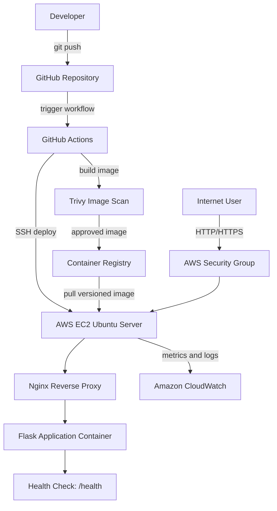

# Planned Architecture Diagram

```mermaid
flowchart TD
    DEV[Developer]
    GH[GitHub Repository]
    GHA[GitHub Actions]
    TRIVY[Trivy Image Scan]
    REG[Container Registry]

    USER[Internet User]
    SG[AWS Security Group]
    EC2[AWS EC2 Ubuntu Server]
    NGINX[Nginx Reverse Proxy]
    APP[Flask Application Container]
    HC[Health Check: /health]
    CW[Amazon CloudWatch]

    DEV -->|git push| GH
    GH -->|trigger workflow| GHA
    GHA -->|build image| TRIVY
    TRIVY -->|approved image| REG
    GHA -->|SSH deploy| EC2
    REG -->|pull versioned image| EC2

    USER -->|HTTP/HTTPS| SG
    SG --> EC2
    EC2 --> NGINX
    NGINX --> APP
    APP --> HC
    EC2 -->|metrics and logs| CW
```
